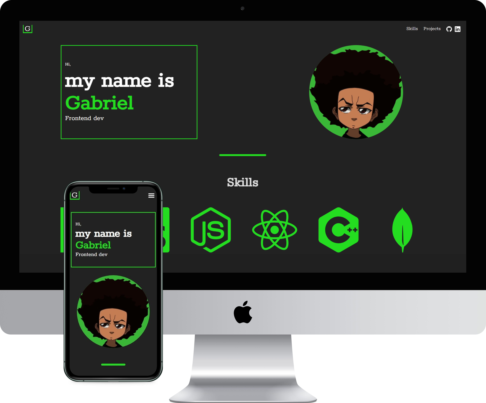

<h1 align="center">
  React Portfolio V2 
  <a href="https://gbcostasant.netlify.app/" target="_blank">https://gbcostasant.netlify.app/</a>
</h1>

  

## Build With

I made other portfolio with React, but i decided to remade, 'because i learn a lot react and others stuffs, i hope you appreciate how i liked to made this website

### technologies

- React js
- Chakra UI
- Node js
- Motion
- Node js
- CSS3
- vscode

### Features

- Fully responsice
- awesome animation made with Motion

## Getting Started

Clone the repository with `git`. You will need `node.js`

### Run

#### Step 1

Install `npm`, you can install `yarn` too.

#### Step 2

in the project directory, use: `npm start` or `yarn start`
